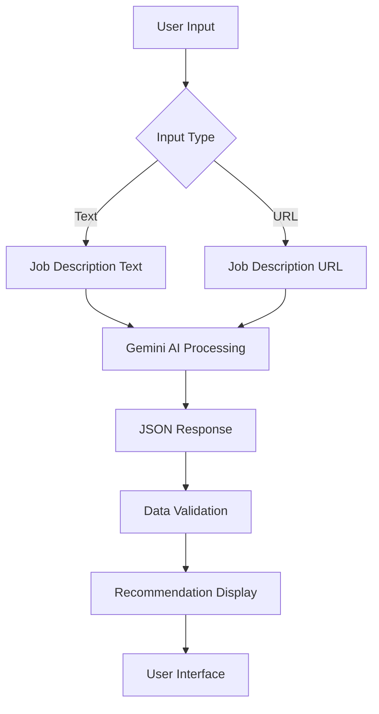

# 🧠 SHL Assessment Recommender

A powerful AI-driven tool that recommends SHL assessments based on job descriptions using Google's Gemini AI.

## 🏗️ Architecture



## 🚀 Features

- 🔍 **Smart Assessment Matching**: Uses Gemini AI to analyze job descriptions
- 🌐 **URL Support**: Can process job descriptions from URLs
- 📊 **Structured Output**: Returns recommendations in a clean, tabular format
- 🔗 **SHL Catalog Integration**: Includes direct links to SHL assessments
- 🧪 **Debug Mode**: Shows raw Gemini output for transparency
- 🔄 **Data Validation**: Ensures all recommendations have required fields

## 🛠️ Tech Stack

- **Frontend**: Streamlit
- **AI Engine**: Google Gemini Pro
- **Data Processing**: Pandas
- **Web Scraping**: BeautifulSoup4
- **HTTP Requests**: Requests
- **Data Validation**: JSON

## ⚙️ Setup

1. **Install Dependencies**:
```bash
pip install streamlit pandas google-generativeai beautifulsoup4 requests
```

2. **Configure API Key**:
```python
genai.configure(api_key="YOUR_API_KEY")
```

3. **Run the Application**:
```bash
streamlit run app.py
```

## 📋 Usage

1. Select input type (Text or URL)
2. Enter job description
3. Click "Recommend Assessments"
4. View and analyze recommendations

## 🧪 Example Input

```text
I am hiring for Java developers who can also collaborate effectively with my business teams. Looking for an assessment(s) that can be completed in 40 minutes.
```

## 🔍 Output Format

```json
[
  {
    "Assessment Name": "Java Programming Test",
    "URL": "https://www.shl.com/...",
    "Remote Testing Support": "Yes",
    "Adaptive/IRT Support": "Yes",
    "Duration": "30 mins",
    "Test Type": "Cognitive"
  }
]
```

## 🛡️ Error Handling

- 🔄 Input validation
- 🔍 URL scraping error handling
- 📊 JSON parsing validation
- ⚠️ API error handling

## 📈 Future Enhancements

- [ ] User authentication
- [ ] Assessment history tracking
- [ ] Custom assessment templates
- [ ] Batch processing support
- [ ] API rate limiting
- [ ] Enhanced error reporting

## 🤝 Contributing

1. Fork the repository
2. Create your feature branch
3. Commit your changes
4. Push to the branch
5. Create a Pull Request

## 📝 License

This project is licensed under the MIT License - see the LICENSE file for details.

## 🙏 Acknowledgments

- Google Gemini AI
- SHL for assessment catalog
- Streamlit for the amazing UI framework 